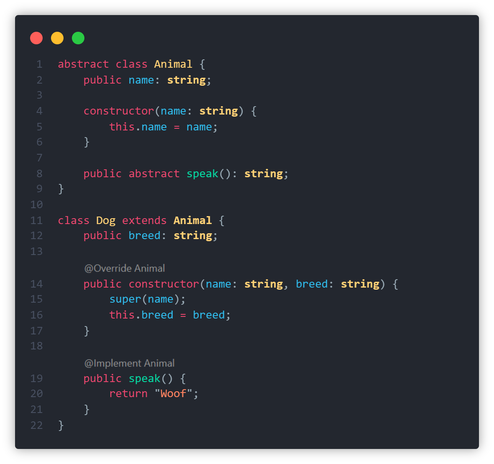
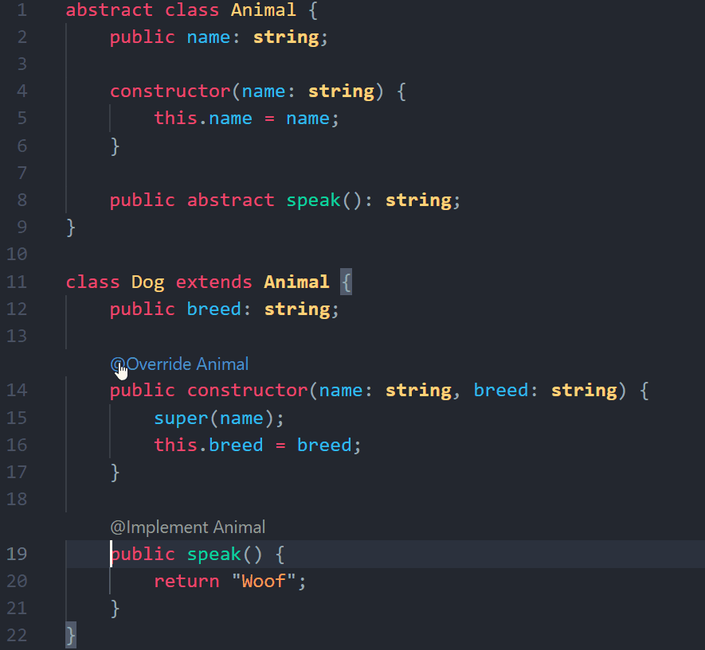
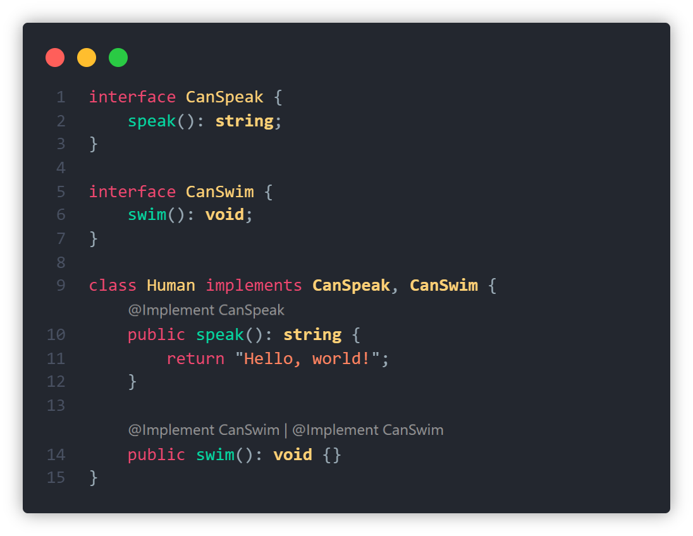
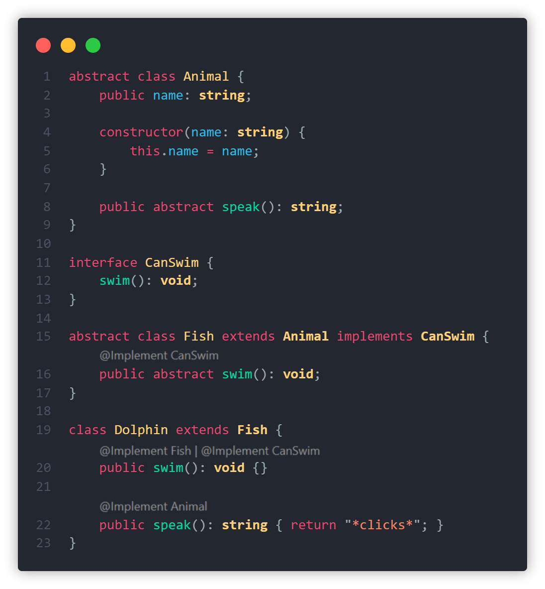

# AnnotationLens³

This extension allows you to view information about class member overrides and implementations in the form of CodeLens annotations for JavaScript and TypeScript.

When a method or field is overriden, a clickable `@Override <name>` text appears that opens a peek window for the method or field that is overriden, while stating the name of the class or interface of the original implementation.  
A lens with the text `@Implement <name>` shows above a method or property that implements an abstract method or property, or an interface.

## Showcase

> **Basic**: Below is an example of the basic functionality of this extension, `name` and `constructor` are being overridden from `Animal` which is reflected with the `@Override Animal` annotation.  
> `speak()`, on the other hand, is being implemented which is why the annotation shows `@Implement Animal`.  
>   
> _Theme: [Theme³](https://marketplace.visualstudio.com/items?itemName=Al3xCubed.theme-cubed)_

> **Peek**: Clicking an annotation opens a peek window and selects the relevant method or property in this peek window.  
>   
> _Theme: [Theme³](https://marketplace.visualstudio.com/items?itemName=Al3xCubed.theme-cubed)_

> **Implementing multiple interfaces**: If a class implements multiple interfaces, the annotations are shown for all these interfaces.  
>    
> _Theme: [Theme³](https://marketplace.visualstudio.com/items?itemName=Al3xCubed.theme-cubed)_

> **Deep Annotations**: To find out whether a method or property is being overridden, it checks the entire tree of superclasses, so it even shows indirect overrides (`@Implement Animal` is shown at line 22, since `Fish` extends `Animal` which has a `speak()` method).  
>   
> _Theme: [Theme³](https://marketplace.visualstudio.com/items?itemName=Al3xCubed.theme-cubed)_
